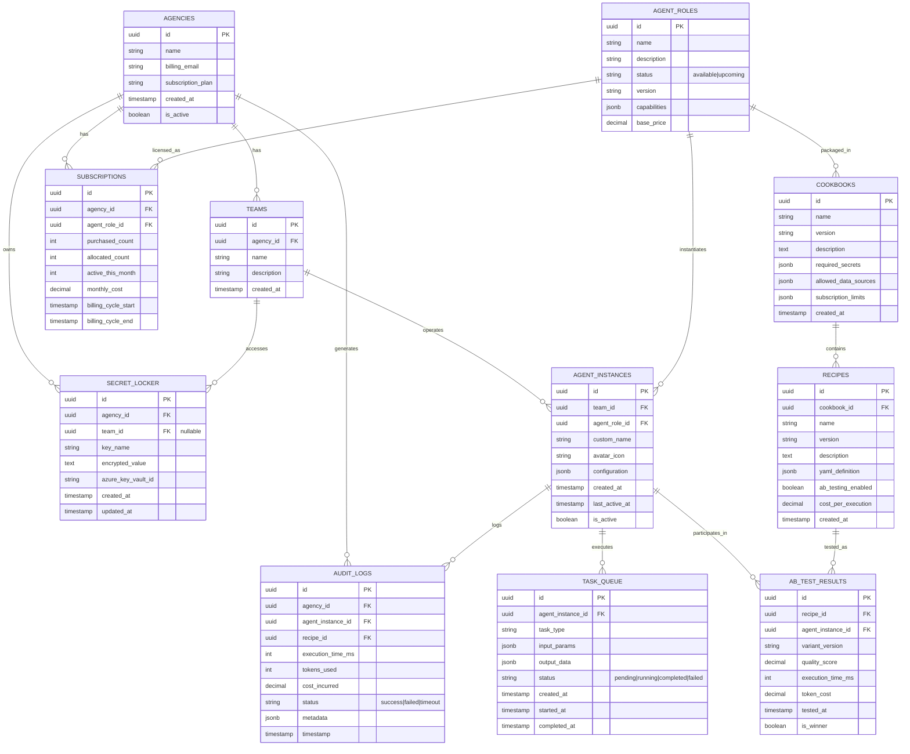

# TeamAI - AI Coding Agent Instructions

## Deployment & Publishing Guide

### Local Development (Current Setup)
**Environment:** GitHub Codespaces with Docker Compose  
**Access URLs:**
- Frontend: `https://<codespace-name>-3000.app.github.dev`
- Backend: `https://<codespace-name>-8000.app.github.dev`

**Prerequisites:**
1. Set all ports to "Public" visibility in VS Code PORTS tab (required for CORS)
2. Environment files configured:
   - `backend/.env` with GOOGLE_CLIENT_ID, GOOGLE_CLIENT_SECRET, JWT_SECRET_KEY, DATABASE_URL, REDIS_URL
   - `frontend/.env` with VITE_API_URL pointing to backend Codespaces URL

**Start Services:**
```bash
cd /workspaces/TeamAI
docker-compose up -d
docker-compose ps  # Verify all services running
docker-compose logs backend frontend  # Check for errors
```

**Test OAuth Flow:**
1. Open frontend URL in browser
2. Click "Sign in with Google"
3. Complete Google authentication
4. Should redirect to dashboard with JWT tokens

### Production Deployment to Azure

#### Option 1: Azure Container Apps (Recommended for MVP)
**Cost:** ~$143/month infrastructure + ~$25/month Groq API = $168/month total

**Deployment Steps:**
1. **Create Azure Resources:**
   ```bash
   # Login to Azure
   az login
   
   # Create resource group
   az group create --name teamai-prod --location eastus
   
   # Create Container Registry
   az acr create --resource-group teamai-prod --name teamairegistry --sku Basic
   
   # Create PostgreSQL (managed)
   az postgres flexible-server create \
     --resource-group teamai-prod \
     --name teamai-db \
     --admin-user adminuser \
     --admin-password <SECURE_PASSWORD> \
     --sku-name Standard_B2s \
     --tier Burstable \
     --storage-size 32
   
   # Create Redis Cache
   az redis create \
     --resource-group teamai-prod \
     --name teamai-redis \
     --location eastus \
     --sku Basic \
     --vm-size c0
   
   # Create Key Vault for secrets
   az keyvault create \
     --resource-group teamai-prod \
     --name teamai-vault \
     --location eastus
   ```

2. **Build and Push Docker Images:**
   ```bash
   # Build backend
   docker build -f infrastructure/docker/Dockerfile.backend -t teamairegistry.azurecr.io/backend:latest .
   
   # Build frontend
   docker build -f infrastructure/docker/Dockerfile.frontend -t teamairegistry.azurecr.io/frontend:latest .
   
   # Login to ACR
   az acr login --name teamairegistry
   
   # Push images
   docker push teamairegistry.azurecr.io/backend:latest
   docker push teamairegistry.azurecr.io/frontend:latest
   ```

3. **Store Secrets in Key Vault:**
   ```bash
   az keyvault secret set --vault-name teamai-vault --name "GOOGLE-CLIENT-ID" --value "<client_id>"
   az keyvault secret set --vault-name teamai-vault --name "GOOGLE-CLIENT-SECRET" --value "<client_secret>"
   az keyvault secret set --vault-name teamai-vault --name "JWT-SECRET-KEY" --value "<generate_secure_key>"
   az keyvault secret set --vault-name teamai-vault --name "DATABASE-URL" --value "<postgres_connection_string>"
   az keyvault secret set --vault-name teamai-vault --name "REDIS-URL" --value "<redis_connection_string>"
   ```

4. **Deploy Container Apps:**
   ```bash
   # Create Container Apps environment
   az containerapp env create \
     --name teamai-env \
     --resource-group teamai-prod \
     --location eastus
   
   # Deploy backend
   az containerapp create \
     --name teamai-backend \
     --resource-group teamai-prod \
     --environment teamai-env \
     --image teamairegistry.azurecr.io/backend:latest \
     --target-port 8000 \
     --ingress external \
     --cpu 2 --memory 4Gi \
     --secrets \
       google-client-id=keyvaultref:<key_vault_uri>/secrets/GOOGLE-CLIENT-ID,identityref:<managed_identity> \
       jwt-secret-key=keyvaultref:<key_vault_uri>/secrets/JWT-SECRET-KEY,identityref:<managed_identity> \
     --env-vars \
       GOOGLE_CLIENT_ID=secretref:google-client-id \
       JWT_SECRET_KEY=secretref:jwt-secret-key
   
   # Deploy frontend
   az containerapp create \
     --name teamai-frontend \
     --resource-group teamai-prod \
     --environment teamai-env \
     --image teamairegistry.azurecr.io/frontend:latest \
     --target-port 3000 \
     --ingress external \
     --cpu 1 --memory 2Gi \
     --env-vars \
       VITE_API_URL=https://teamai-backend.<region>.azurecontainerapps.io
   ```

5. **Configure Custom Domain (Optional):**
   ```bash
   # Add custom domain
   az containerapp hostname add \
     --resource-group teamai-prod \
     --name teamai-frontend \
     --hostname app.teamai.com
   
   # Add SSL certificate
   az containerapp ssl upload \
     --resource-group teamai-prod \
     --name teamai-frontend \
     --hostname app.teamai.com \
     --certificate-file /path/to/cert.pfx \
     --password <cert_password>
   ```

6. **Run Database Migrations:**
   ```bash
   # Connect to backend container
   az containerapp exec \
     --name teamai-backend \
     --resource-group teamai-prod \
     --command "/bin/bash"
   
   # Inside container, run Alembic migrations
   alembic upgrade head
   ```

7. **Update Google OAuth Redirect URIs:**
   - Go to Google Cloud Console → APIs & Services → Credentials
   - Edit OAuth 2.0 Client ID
   - Add authorized redirect URIs:
     - `https://teamai-backend.<region>.azurecontainerapps.io/api/v1/auth/google/callback`
     - `https://app.teamai.com/api/v1/auth/google/callback` (if using custom domain)

#### Option 2: Azure Kubernetes Service (For Scale)
**Use when:** Handling 100+ agencies or need advanced orchestration

**Deployment Steps:**
1. Create AKS cluster
2. Apply Kubernetes manifests from `infrastructure/kubernetes/`
3. Configure Helm charts for PostgreSQL, Redis
4. Deploy ingress controller with SSL
5. Configure horizontal pod autoscaling

#### Option 3: Azure Functions (For Serverless Agent Runtime)
**Use for:** Agent execution engine (LangGraph workflows)

**Deployment Steps:**
1. Package agent code as Azure Functions
2. Configure Durable Functions for stateful workflows
3. Connect to Groq API via secure endpoints
4. Monitor execution logs in Application Insights

### CI/CD Pipeline (GitHub Actions)

**Setup Automated Deployments:**
1. Create GitHub secrets:
   - `AZURE_CREDENTIALS` (service principal)
   - `ACR_USERNAME`, `ACR_PASSWORD`
   - `AZURE_WEBAPP_PUBLISH_PROFILE`

2. GitHub Actions workflow (`.github/workflows/deploy.yml`):
   ```yaml
   name: Deploy to Azure
   on:
     push:
       branches: [main]
   jobs:
     deploy:
       runs-on: ubuntu-latest
       steps:
         - uses: actions/checkout@v2
         - name: Build and push Docker images
           run: |
             docker-compose build
             docker tag backend:latest $ACR_REGISTRY/backend:$GITHUB_SHA
             docker push $ACR_REGISTRY/backend:$GITHUB_SHA
         - name: Deploy to Container Apps
           uses: azure/container-apps-deploy-action@v1
           with:
             imageToDeploy: ${{ env.ACR_REGISTRY }}/backend:${{ github.sha }}
   ```

### Post-Deployment Checklist
- [ ] Verify all environment variables loaded from Key Vault
- [ ] Test OAuth flow with production Google credentials
- [ ] Run database migrations (Alembic)
- [ ] Verify CORS allows production frontend domain
- [ ] Test agent execution with Groq API
- [ ] Configure monitoring alerts in Azure Monitor
- [ ] Set up backup strategy for PostgreSQL
- [ ] Enable auto-scaling rules for Container Apps
- [ ] Test Redis cache connectivity
- [ ] Verify JWT token generation and validation

### Rollback Procedure
```bash
# Revert to previous container image
az containerapp revision list --name teamai-backend --resource-group teamai-prod
az containerapp revision activate --revision <previous-revision-name>
```

---

## Project Overview (Business Context)

1.  **The Scaling Challenge:** Addresses the critical growth bottleneck for Digital Marketing Agencies: the linear dependency between revenue growth and the cost of acquiring new human talent and physical office space.
2.  **Inorganic Workforce Expansion:** Deploys specialized AI Agents as an "inorganic" growth lever, allowing agencies to bypass headcount caps and real estate constraints to scale operations infinitely without physical overhead.
3.  **Virtual Staffing Marketplace:** A B2B portal that functions as a virtual HR department, allowing agencies to "hire" (subscribe to) AI roles like SEO Specialists or Copywriters instantly, reducing recruitment time from months to minutes.
4.  **Dynamic Resource Allocation:** empowers Agency Admins to treat AI agents as flexible "heads," dynamically assigning them to different client teams to handle peak workloads without the friction of traditional hiring.
5.  **Accountable Performance:** Provides enterprise-grade governance where this virtual workforce is managed with the same rigor as human staff, using mandatory audit logs and performance tracking to ensure ROI and quality control.

### Architecture Visualization


## Project Overview: Business & Operational Model

1.  **Inorganic Growth Solution:** A centralized B2B platform designed to solve the "Agency Scaling Trap" (linear costs of hiring + office space) by allowing agencies to subscribe to an "inorganic" workforce of AI agents, effectively replacing the need for physical expansion.
2.  **Agency Admin Governance (The "Virtual HR"):** Establishes a top-level "Agency Admin" role responsible for "hiring" (purchasing) agents from the Marketplace, managing global billing, and controlling sensitive assets via a centralized "Secret Locker" (Azure Key Vault with agency-namespaced secrets).
3.  **Hierarchical Resource Allocation:** Mimics real-world agency structure with 3-tier hierarchy:
    - **Platform Level:** Global Marketplace (browse available/upcoming agent roles, versioned catalog)
    - **Agency Level:** Admin purchases agent instances, allocates to teams, manages shared resources (Secret Locker, Subscription Tracker, Global Audit Log)
    - **Team Level:** Team users interact with allocated agents via Team Config Portal (schedule tasks, view outputs, no billing access)
4.  **Agent Allocation Model:** Dedicated instances per team (Team A's "Rover" = isolated state/config, no cross-team data leakage). Admin allocates purchased agents; teams customize (name, avatar, parameters within subscription limits).
5.  **Secret Locker Access Control:** Team-scoped secrets (Team A's agents access only Team A's keys in Key Vault namespace `agency:123:team:456:*`). Prevents cross-team credential exposure.
6.  **Billing Model (MVP):** Per-agent monthly subscription (usage-metered but billed as seat license). "Monthly Active Agents" = any agent executing ≥1 task that month. Target state: modular topups (pay for extra capacity/recipes/components).
7.  **Transparent Capability Model:** Utilizes a "Cookbook & Recipe" framework to package agent skills. Marketplace shows clear SOP definitions (what an agent can do) before purchase. Supports versioning (SEO Specialist v1 vs v2); agents stay on purchased version (no auto-upgrade).
8.  **Team Config Portal Features:** Task scheduling (manual trigger in MVP, cron jobs in target state), task queue management, agent interaction UI, performance monitoring (execution time, success rate, per-agent metrics). No access to billing, secret management, or global audit logs.

## Project Overview: Technical Agent Composition (The "Kitchen" Architecture)

1.  **Four Atomic Building Blocks (Globally Available, Locally Configured):**
    - **Data Sources:** External systems to read/write data (HubSpot CRM, Google Analytics, MySQL, customer websites). Configured by customer with credentials in Secret Locker.
    - **Connectors:** Adapter classes interfacing with Data Sources (e.g., `HubSpotConnector`, `PostgresConnector`, `SemrushConnector`). Reusable Python classes in shared library.
    - **Processors:** Transform/analyze data (e.g., `TextProcessor` for LLM calls, `HTMLParser`, `SentimentAnalyzer`). Reusable Python classes in shared library.
    - **Components:** Generic utilities (e.g., `Authenticator`, `RateLimiter`, `CacheManager`, `Logger`). Reusable Python classes in shared library.

2.  **Recipe-Based Workflows:** Recipes are parameterized YAML templates defining executable workflows implemented as LangGraph DAGs. Platform provides base recipes; customers configure with their secrets/data sources. Recipes support branching, parallel execution, and loops. Configuration includes parameters (e.g., `max_pages: 100`); no structural changes allowed in MVP. Recipes stored in `recipes/` directory.

3.  **Recipe Evaluator (Product Differentiator):** Dual-purpose system:
    - **LangGraph Executor:** Orchestrates DAG execution (nodes, edges, state management)
    - **ML Feedback Loop:** Implements A/B Testing Framework (run Recipe v1 vs v2, compare quality/cost/speed, ML model picks winner). Later adds Post-Execution Quality Scoring (user ratings → ML training). Continuously improves recipe performance over time.

4.  **Cookbook-Centric Architecture:** Cookbooks are capability packages bundling related recipes (e.g., "SEO Specialist" contains "Site Audit" + "Keyword Research"). Cookbooks are pre-built YAML configurations stored in `cookbooks/` directory. Cookbooks reference (not own) recipes and components. Versioned (v1.0, v2.0).

5.  **Secure Input Injection:** Components/Connectors access Data Sources via Secret Locker (Azure Key Vault with agency-namespaced secrets: `agency:123:semrush_api_key`). Agents remain stateless; secrets injected at runtime. Multi-tenant isolation via PostgreSQL row-level security and Redis namespaced keys.

6.  **Mandatory Compliance Layer:** Every Agent instance includes immutable "Subscription Tracking Recipe" that meters usage (execution count, LLM token consumption, processing time) and reports to PostgreSQL for billing accuracy. Tracks per-agent, per-recipe metrics.

7.  **Stateful Execution:** Agents run as Azure Durable Functions to maintain conversation context and task state across invocations. State stored in Azure Storage (Durable Functions backend). Supports resume-on-failure patterns.

8.  **Agent Instance Composition:** Agent = 1+ Cookbooks + Mandatory Subscription Tracking. Configuration tied to subscription tier (e.g., `max_pages` parameter limited by plan). MVP pricing: per-agent subscription. Target state: modular topups (pay for additional components/recipes/capacity).

### Agent Composition Visualization

```mermaid
graph LR
    subgraph "Level 0: External Inputs"
        DS[(🗄️ Data Sources<br/>HubSpot CRM<br/>Google Analytics<br/>MySQL DB<br/>Customer Websites)]
        SECRETS[(🔐 Secret Locker<br/>Azure Key Vault<br/>API Keys & Credentials)]
    end

    subgraph "Level 1: Atomic Building Blocks (Global Library)"
        direction TB
        
        subgraph "Connectors"
            C_HUBSPOT[HubSpotConnector]
            C_POSTGRES[PostgresConnector]
            C_SEMRUSH[SemrushConnector]
        end
        
        subgraph "Processors"
            P_LLM[TextProcessor<br/>Groq/OpenAI]
            P_HTML[HTMLParser]
            P_SENTIMENT[SentimentAnalyzer]
        end
        
        subgraph "Components"
            COMP_AUTH[Authenticator]
            COMP_RATE[RateLimiter]
            COMP_CACHE[CacheManager]
        end
        
        SECRETS -.->|Injects at Runtime| COMP_AUTH
        DS -.->|Read/Write| C_HUBSPOT
        DS -.->|Read/Write| C_POSTGRES
        COMP_AUTH -.->|Secures| C_HUBSPOT
        COMP_AUTH -.->|Secures| C_SEMRUSH
    end

    subgraph "Level 2: Recipes (YAML Workflows)"
        direction TB
        
        subgraph "Recipe: SEO Audit"
            R_SEO_EVAL((Recipe Evaluator<br/>LangGraph + A/B Test))
            R_SEO_FLOW[Workflow DAG:<br/>Fetch Pages → Analyze → Report]
            R_SEO_EVAL --> R_SEO_FLOW
        end

        subgraph "Recipe: Content Generation"
            R_CONTENT_EVAL((Recipe Evaluator<br/>LangGraph + A/B Test))
            R_CONTENT_FLOW[Workflow DAG:<br/>Prompt → Process → Draft]
            R_CONTENT_EVAL --> R_CONTENT_FLOW
        end

        subgraph "MANDATORY: Subscription Tracking"
            R_SUB_EVAL((Recipe Evaluator<br/>Compliance))
            R_SUB_FLOW[Workflow:<br/>Meter Usage → Report Billing]
            R_SUB_EVAL --> R_SUB_FLOW
        end
    end
    
    subgraph "Level 3: Cookbooks (Capability Bundles)"
        CB_SEO[📚 Cookbook: SEO Specialist v1.0<br/>- Site Audit Recipe<br/>- Keyword Analysis Recipe<br/>- Backlink Checker Recipe]
        CB_SOCIAL[📚 Cookbook: Social Media Scheduler v1.0<br/>- Content Generator Recipe<br/>- Trend Analyzer Recipe]
    end

    subgraph "Level 4: Agent Instance (Deployed Product)"
        AGENT[🤖 Agent: 'Rover'<br/>Team: SEO Department<br/>Cookbooks: SEO Specialist<br/>Status: Active<br/>Subscription Tier: Professional]
    end

    %% Component to Recipe connections
    C_HUBSPOT & C_POSTGRES & P_HTML --> R_SEO_FLOW
    P_LLM --> R_SEO_FLOW
    P_LLM --> R_CONTENT_FLOW
    COMP_RATE & COMP_CACHE --> R_SEO_FLOW
    COMP_RATE & COMP_CACHE --> R_CONTENT_FLOW

    %% Recipe to Cookbook connections
    R_SEO_EVAL --> CB_SEO
    R_CONTENT_EVAL --> CB_SOCIAL

    %% Cookbook to Agent connections
    CB_SEO --> AGENT
    CB_SOCIAL -.->|Optional| AGENT
    R_SUB_EVAL -->|Mandatory| AGENT

    %% Styling
    classDef external fill:#e0e0e0,stroke:#757575,stroke-dasharray: 5 5
    classDef connector fill:#fff3e0,stroke:#f57c00
    classDef processor fill:#e1f5fe,stroke:#0277bd
    classDef component fill:#ffecb3,stroke:#ff6f00
    classDef recipe fill:#c8e6c9,stroke:#388e3c
    classDef evaluator fill:#f48fb1,stroke:#c2185b
    classDef cookbook fill:#bbdefb,stroke:#1565c0
    classDef agent fill:#d1c4e9,stroke:#512da8,stroke-width:3px

    class DS,SECRETS external
    class C_HUBSPOT,C_POSTGRES,C_SEMRUSH connector
    class P_LLM,P_HTML,P_SENTIMENT processor
    class COMP_AUTH,COMP_RATE,COMP_CACHE component
    class R_SEO_FLOW,R_CONTENT_FLOW,R_SUB_FLOW recipe
    class R_SEO_EVAL,R_CONTENT_EVAL,R_SUB_EVAL evaluator
    class CB_SEO,CB_SOCIAL cookbook
    class AGENT agent
```



## Project Overview: Technology Stack (Confirmed)

**Architecture:** Monorepo with modular Python backend + React frontend  
**Backend:** Python + FastAPI (API Gateway & Orchestrator)  
**Agent Framework:** LangChain + LangGraph (Recipe workflows with A/B testing)  
**Frontend:** React + TypeScript (Agency Admin Portal + Marketplace UI)  
**Runtime:** Azure Functions Consumption Plan (Python, Durable Functions for state, 3-5s cold start tolerance)  
**LLM Provider:** Groq (primary, llama-3.1-8b-instant → llama-3.3-70b-versatile fallback), OpenAI (backup)  
**Database:** Self-managed PostgreSQL on Azure Container Apps (cost optimization, ACID compliance)  
**Secrets Management:** Single Azure Key Vault with agency-namespaced secrets (cost-efficient multi-tenancy)  
**Deployment:** Docker containers on Azure Container Apps (Frontend + Backend)  
**CI/CD:** GitHub Actions (free tier)  
**Testing:** pytest (backend), Jest + React Testing Library (frontend)  
**Monitoring:** Azure Monitor free tier + Grafana  

**Cost Optimization:** Target 40%+ profit margin with multifold customer savings via: Groq's cheap inference ($0.05-$0.60 per 1M tokens), consumption-based Azure Functions (JIT scaling), self-managed PostgreSQL (~$30/month), single Key Vault ($0.03/10k ops), free tooling (BeautifulSoup, httpx, pypdf2), multi-tenant architecture (shared infrastructure across agencies).

### Azure Infrastructure Deployment


### Cost Breakdown (Estimated Monthly)

| Service | Configuration | Estimated Cost |
|---------|--------------|----------------|
| **Container Apps (Frontend)** | 1 vCPU, 2GB RAM | $15 |
| **Container Apps (Backend)** | 2 vCPU, 4GB RAM | $30 |
| **Container Apps (PostgreSQL)** | 2 vCPU, 4GB RAM | $30 |
| **Azure Functions** | Consumption Plan (1M executions) | $20 |
| **Azure Cache for Redis** | Basic C0 (250MB) | $15 |
| **Azure Blob Storage** | Hot tier (10GB) | $2 |
| **Azure Key Vault** | Standard (1000 ops/day) | $1 |
| **Azure Container Registry** | Basic | $5 |
| **Azure Monitor** | Free tier (5GB logs) | $0 |
| **Groq API** | ~50M tokens/month | $25 |
| **Total Infrastructure** | | **$143/month** |
| **Per-Agency Cost** | 10 agencies | **$14.30/agency** |
| **Revenue (10 agencies × $250/mo)** | | **$2,500** |
| **Profit Margin** | | **94%** |

## Project Structure
- Root directory contains core project files
- `.gitignore` is configured for Python development (bytecode, venvs, test coverage, distribution files)
- MIT License (2025 dlai-sd)

## Development Environment
This project runs in a dev container on Ubuntu 24.04.3 LTS with:
- Python tooling expected
- mentioned tools and dependencies installed
- Node.js and npm for frontend development
- Java SDK for any Java components
- azure CLI for cloud interactions
- Docker for containerization
- VS Code with Remote - Containers extension for development
- Pre-installed Python packages for web development (FastAPI, etc.)
- Poetry for dependency management
- pytest for testing
- pylint and black for code quality and formatting
- Make for build automation
- pipx for isolated Python CLI tools
- pre-commit for Git hooks
- husky for Git hooks
- npm packages for frontend linting and formatting
- Azure Functions Core Tools for serverless functions
- AWS CLI for cloud interactions
- Terraform for infrastructure as code
- kubectl for Kubernetes management
- Docker Compose for multi-container setups
- Azure CLI for cloud interactions 
- Helm for Kubernetes package management
- Security tools like bandit for static analysis
- CICD tools like GitHub Actions runner
- - Git for version control
- Standard Linux command-line tools available

## Coding Standards
- Following PEP 8 for Python code style
- Using black for code formatting
- Using pylint for static code analysis
- Writing type-annotated code
- Following best practices for FastAPI applications
- Using async programming where appropriate
- Structuring code into modules and packages
- Writing modular and reusable code
- using secret valutes for sensitive information
- Writing unit and integration tests with pytest
- Using fixtures for test setup and teardown
- Following TDD principles where feasible
- Documenting code with Sphinx or similar tools
- Using Git for version control with feature branches
- Writing clear and descriptive commit messages
- Conducting code reviews for all pull requests

## Best Practices
- Keeping functions and methods small and focused 
- Using type hints for function signatures
- Adding docstrings for modules, classes, and functions
- Creating tests alongside new features

## Python Environment
When creating the Python project structure:
- Use virtual environments (venv or similar) 
- Create a `requirements.txt` or `pyproject.toml` for dependencies
- Consider adding `setup.py` or `pyproject.toml` for package configuration
- Structure code in a source directory (e.g., `src/` or `teamai/`)

## Git Workflow
- Main branch: `main`
- This is a fresh repository (single initial commit)
- Commit messages should be clear and descriptive

## Database Schema Design

### Entity Relationship Diagram



### Key Schema Features

1. **Multi-Tenancy:** Agency ID in all top-level tables, enforced with row-level security
2. **Secret Isolation:** Team-scoped secrets prevent cross-team access
3. **Usage Tracking:** Audit logs capture execution metrics for billing accuracy
4. **A/B Testing:** Dedicated table for recipe performance comparison
5. **Subscription Management:** Track purchased vs allocated vs active agents
6. **JSONB Flexibility:** Store YAML configs, metadata without schema changes

## Files to Create Next
Based on the confirmed architecture, the monorepo structure will include:

**Infrastructure:**
- `.github/workflows/` for CI/CD pipelines (pytest, Docker build, Azure deploy)
- `docker-compose.yml` for local development environment
- `Dockerfile` for backend (FastAPI) and frontend (React) services
- `.env.example` for environment variable templates

**Backend (Python + FastAPI):**
- `backend/` directory with FastAPI application
- `backend/pyproject.toml` or `requirements.txt` for Python dependencies
- `User Flow Diagrams

### Agency Admin Purchase & Allocation Flow


### Team User Agent Interaction Flow


## backend/app/` for API routes, models, and business logic
- `backend/agents/` for agent orchestration and LangGraph workflows
- `backend/components/` for reusable recipe components (WebCrawler, LLMProcessor, etc.)
- `backend/tests/` with pytest configuration

**Frontend (React + TypeScript):**
- `frontend/` directory with React application
- `frontend/package.json` for npm dependencies
- `frontend/src/` for components, pages, and state management
- `frontend/tsconfig.json` for TypeScript configuration
- `frontend/.env.example` for API endpoints

**Shared Resources:**
- `cookbooks/` for YAML cookbook definitions
- `recipes/` for YAML recipe definitions
- `docs/` for architecture documentation and API specs
- `scripts/` for deployment and utility scripts

**Database:**
- `migrations/` for PostgreSQL schema migrations (Alembic)
- `schema.sql` for initial database structure

## YAML Schema Design

### Cookbook Structure
Cookbooks define agent capabilities and bundle related recipes. Stored in `cookbooks/` directory:
```yaml
cookbook:
  id: "seo-specialist-v1"
  name: "SEO Specialist"
  description: "Site auditing, keyword research, technical SEO"
  version: "1.0.0"
  author: "TeamAI"
  
  # Required secrets for this cookbook
  required_secrets: ["google_search_console_api_key", "semrush_api_key"]
  
  # Data sources this cookbook can access
  allowed_data_sources:
    - type: "web_crawler"
      max_pages: 100
    - type: "analytics_api"
      providers: ["google_analytics", "google_search_console"]
  
  # Recipes bundled in this cookbook
  recipes: ["site-audit", "keyword-analysis", "broken-link-checker"]
  
  # Subscription tier constraints
  subscription_limits:
    max_pages_per_crawl: 100
    max_executions_per_month: 500
```

### Recipe Structure
Recipes define executable workflows using LangGraph. Stored in `recipes/` directory:
```yaml
recipe:
  id: "site-audit"
  name: "Comprehensive Site Audit"
  description: "Crawl website, analyze technical SEO issues, generate report"
  cookbook: "seo-specialist-v1"
  version: "1.2.0"
  
  # Input schema (validated with Pydantic)
  inputs:
    - name: "website_url"
      type: "string"
      required: true
      validation: "url"
    - name: "max_depth"
      type: "integer"
      default: 3
      range: [1, 10]
    - name: "include_images"
      type: "boolean"
      default: true
  
  # Execution workflow (LangGraph nodes)
  workflow:
    nodes:
      - id: "fetch_pages"
        component: "WebCrawler"
        config:
          max_pages: "{{ inputs.max_depth * 20 }}"
          respect_robots: true
        secrets:
          # Fetch from Secret Locker at runtime
          api_key: "secret:semrush_api_key"
        
      - id: "analyze_structure"
        component: "LLMProcessor"
        config:
          model: "groq-llama-3.1-8b-instant"
          fallback_model: "groq-llama-3.3-70b-versatile"
          temperature: 0.2
          prompt_template: |
            Analyze this site structure for SEO issues:
            {fetch_pages.output}
            
            Focus on:
            - Missing meta tags
            - Broken links
            - Duplicate content
            - Page load speed
        depends_on: ["fetch_pages"]
      
      - id: "generate_report"
        component: "ReportGenerator"
        config:
          format: "markdown"
          template: "seo_audit_template.md"
          include_sections:
            - "executive_summary"
            - "critical_issues"
            - "recommendations"
        depends_on: ["analyze_structure"]
    
    # Define execution order (DAG)
    edges:
      - from: "fetch_pages"
        to: "analyze_structure"
      - from: "analyze_structure"
        to: "generate_report"
    
    # Final output
    output:
      type: "report"
      format: "markdown"
      source: "generate_report.output"
  
  # Subscription tracking (mandatory)
  compliance:
    track_usage: true
    billable_units: "per_execution"
    cost_per_unit: 0.50
  
  # A/B testing metadata
  ab_testing:
    enabled: true
    variants: ["v1.2.0", "v1.3.0-beta"]
    success_metric: "quality_score"  # or "execution_time", "token_cost"
```

### Component Library
Reusable components referenced in recipes (Python classes in `backend/components/`):
- `WebCrawler`: Fetch and parse web pages (uses httpx + BeautifulSoup)
- `LLMProcessor`: Interface with Groq/OpenAI/custom ML models
- `ReportGenerator`: Format outputs (Markdown, PDF, JSON)
- `DataFetcher`: Query APIs/databases (generic HTTP client)
- `Authenticator`: OAuth/API key management
- `RateLimiter`: Prevent API throttling (Redis-backed)
- `CacheManager`: Store intermediate results (Redis TTL cache)
- Use Sphinx or MkDocs for documentation generation
- Document API endpoints with OpenAPI/Swagger
- Maintain a `docs/` directory for project documentation
- Create a `CHANGELOG.md` to track changes over time
- Create new documentation only when asked by user

## Contextual Guidelines
- Always consider the business context of TeamAI when generating code or documentation
- Ensure code aligns with the architectural principles outlined above
- Agents must be composed of Cookbooks → Recipes → Components (YAML-defined)
- All agent executions must be tracked for billing (mandatory compliance layer)
- Secret management through Azure Key Vault (never hardcode credentials)
- Stateful workflows use Azure Durable Functions
- LLM calls dynamically select cheapest available Groq model (fallback: llama-3.3-70b → llama-3.1-8b)
- PostgreSQL enforces multi-tenancy (agency → teams → agents hierarchy)
- README should reflect project's purpose, structure, and latest progress

## MVP Scope (1-Month Timeline)

**Phase 1 Deliverables:**
1. **Agency Admin Portal:**
   - User authentication (Azure AD B2C or custom)
   - Marketplace UI (browse 3 agents: SEO Specialist, Social Media Scheduler, Lead Qualifier)
   - Agent purchase flow (select agent → assign to team → configure secrets)
   - Secret Locker management (add/edit API keys, namespaced by team)
   - Subscription dashboard (active agents, usage metrics, billing preview)
   - Global Audit Log viewer (execution history, performance metrics)

2. **Team Config Portal:**
   - Agent interaction UI (manual task trigger, view outputs)
   - Task queue (see pending/completed tasks)
   - Per-agent performance dashboard (success rate, avg execution time)
   - No billing or secret management access

3. **Agent Runtime:**
   - 3 pre-built agents with 5-7 recipes total:
     - **SEO Specialist:** Site Audit, Broken Link Checker, Meta Tag Analyzer
     - **Social Media Scheduler:** Content Idea Generator, Trend Analyzer
     - **Lead Qualifier:** CRM Data Scorer, Email Drafter
   - LangGraph-based recipe execution (DAG workflows)
   - Groq integration (llama-3.1-8b-instant primary, llama-3.3-70b-versatile fallback)
   - Azure Durable Functions for stateful execution
   - Mandatory Subscription Tracking Recipe (meters usage)

4. **A/B Testing Framework (Core Differentiator):**
   - Recipe versioning system (v1 vs v2 comparison)
   - Parallel execution engine (run both versions, compare outputs)
   - Metrics collector (quality score, cost per execution, latency)
   - ML model trainer (basic logistic regression for winner selection)
   - Admin UI to view A/B test results

5. **Backend Infrastructure:**
   - FastAPI REST API (CRUD for agencies, teams, agents, recipes)
   - PostgreSQL schema (agencies, teams, agent_instances, recipes, audit_logs, ab_tests)
   - Alembic migrations
   - Azure Key Vault client (secret injection)
   - Redis for caching/rate limiting

6. **Deployment:**
   - Docker Compose for local dev
   - Dockerfiles for frontend/backend
   - GitHub Actions CI/CD (test → build → deploy to Azure Container Apps)
   - Environment configs (.env.example, Azure secrets)

**Deferred to Phase 2:**
- Customer-built cookbooks/recipes
- Modular pricing topups
- Scheduled/cron-based tasks
- Multi-region deployment
- Advanced analytics (cost attribution, ROI calculator)
- Post-Execution Quality Scoring (user ratings) 

## Agent Behavior Guidelines

### Communication & Documentation
1. **Do NOT produce documents or summaries unless explicitly requested by user**
   - No markdown files documenting changes
   - No summary documents after completing work
   - Keep responses concise and action-oriented
   - Only create documentation when user asks: "document this", "create a guide", etc.

2. **Do NOT write long descriptions unless explicitly requested by user**
   - Keep explanations brief (1-3 sentences for simple tasks)
   - Avoid verbose introductions or conclusions
   - Get straight to the point
   - Expand details only when user asks for clarification

### Testing Requirements
3. **Include UI testing in the final iteration of major work**
   - Backend API testing alone is NOT sufficient for user-facing features
   - Must test in actual browser (not just curl commands)
   - Verify end-to-end user flows (login → action → result)
   - Document test results with actual observations (not assumptions)
   - Definition of "tested": Backend + Frontend + Integration all verified

### Session Management
4. **Proactively notify user when fresh chat is needed**
   - Alert user when conversation context becomes too large
   - Recommend fresh session when encountering repeated errors
   - Suggest new chat when switching to completely different work area
   - Signal when accumulated decisions may benefit from clean slate

## Notes
- Project is in initial setup phase - major architectural decisions pending
- Update these instructions as the project structure evolves
- Document key patterns and conventions as they emerge
