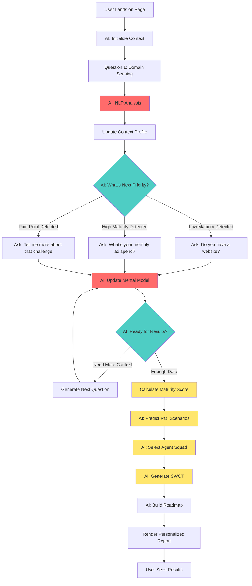

# AI-Orchestrated Customer Assessment Architecture
**Version:** 1.0  
**Date:** December 18, 2025  
**Principle:** "AI is the nervous system, not a feature"

---

## Problem Statement
Static questionnaires feel robotic. Even with statistical validation, if the experience doesn't FEEL intelligent, customers disengage. We need **AI to sense, understand, and adapt** in real-time.

---

## AI-Native Design Philosophy

### Traditional Approach (What We're NOT Building)
```
User answers Q1 → Store in database
User answers Q2 → Store in database
...
User answers Q15 → Run statistical model → Show results
```
**Problem:** AI only appears at the end. Experience feels mechanical.

### AI-Native Approach (What We ARE Building)
```
Q1: "What's your business domain?" → AI infers industry, size, maturity from answer
Q2: AI generates next question based on Q1 inference
Q3: AI detects pain points, adjusts tone and examples
Q4-15: Every answer refines AI's mental model of the customer
Results: AI generates personalized report with context-aware recommendations
```
**Benefit:** Customer feels understood from minute 1.

---

## The 5-Layer AI Intelligence System

### Layer 1: Initial Domain Sensing (First 30 Seconds)
**Goal:** Understand who the customer is before they finish typing their first answer.

#### Question 1: "Describe your business in one sentence"
**User Input:** "I run a dental clinic with 3 locations in Mumbai"

**AI Processing (Behind the Scenes):**
```python
# 1. Named Entity Recognition (spaCy)
entities = nlp(user_input)
# → "dental clinic" (PRODUCT), "3 locations" (QUANTITY), "Mumbai" (LOCATION)

# 2. Industry Classification (LLM)
industry = llm_classify(user_input, categories=[
    "Healthcare", "Retail", "SaaS", "Manufacturing", "Services", "Restaurant"
])
# → "Healthcare" (confidence: 0.95)

# 3. Business Size Inference (Rule-based + ML)
size = infer_size(user_input)
# "3 locations" → Small/Medium business (not solopreneur, not enterprise)

# 4. Digital Maturity Signal Detection
maturity_signals = extract_signals(user_input)
# No mention of "website", "social media", "CRM" → Likely low digital maturity

# 5. Build Initial Context Profile
customer_context = {
    "industry": "Healthcare - Dental",
    "sub_vertical": "Multi-location dental clinic",
    "geography": "India - Mumbai",
    "size": "SMB (3 locations)",
    "estimated_maturity": 2.5,  # Initial guess
    "language_tone": "Professional, medical terminology acceptable",
    "likely_pain_points": ["Patient acquisition", "Appointment scheduling", "Local SEO"]
}
```

**Immediate Adaptation:**
- Next questions use healthcare examples
- Language avoids jargon like "conversion funnel" → uses "patient journey"
- Metrics framed as "patients per month" not "leads"

---

### Layer 2: Continuous Context Enrichment
**Goal:** Every answer updates the AI's mental model.

#### Question 5: "How do you currently get new customers/patients?"
**User Input:** "Mostly word of mouth, some newspaper ads"

**AI Context Update:**
```python
# Update maturity score
context.digital_channels = ["word_of_mouth", "offline_ads"]
context.estimated_maturity = 2.0  # Downgrade from 2.5 → Very traditional

# Identify gaps
context.missing_capabilities = ["website", "social_media", "online_booking"]

# Adjust recommendation strategy
context.agent_priorities = [
    "WebsiteBuilder",  # Priority 1: Establish digital presence
    "LocalSEO",        # Priority 2: Google Business Profile
    "SocialMedia"      # Priority 3: Facebook/Instagram for local reach
]

# Adjust tone
context.communication_style = "Beginner-friendly, avoid tech terms"
```

**Next Question Adaptation:**
- **If user had said "Facebook ads + Google Ads":** Next question would be "What's your monthly ad spend?" (assumes high maturity)
- **Since user said "newspaper ads":** Next question becomes "Do you have a website?" (validates low maturity hypothesis)

---

### Layer 3: Intelligent Question Generation
**Goal:** Don't follow a fixed script. AI decides what to ask next.

#### Decision Tree (AI-Powered)
```python
def generate_next_question(context, answer_history):
    # Use LangGraph state machine
    current_state = context.current_understanding
    
    # Scenario 1: Detected low maturity + no website
    if current_state.maturity < 3 and "website" not in current_state.digital_assets:
        return generate_question(
            template="website_importance",
            personalization={
                "industry": context.industry,
                "tone": "educational",
                "example": "Other dental clinics in Mumbai get 50% of bookings from their website"
            }
        )
    
    # Scenario 2: Detected high maturity + running ads
    elif current_state.maturity > 5 and "paid_ads" in current_state.channels:
        return generate_question(
            template="attribution_tracking",
            personalization={
                "tone": "technical",
                "example": "Are you tracking which ad campaigns drive actual revenue, not just clicks?"
            }
        )
    
    # Scenario 3: Detected pain point in previous answer
    elif "struggling with" in answer_history[-1].lower():
        pain_point = extract_pain_point(answer_history[-1])
        return generate_empathy_question(pain_point)
        # "You mentioned struggling with X. How much time does this cost you weekly?"
```

**Example Flow:**
```
User: "I run a dental clinic..."
AI: [Detects healthcare + Mumbai + low digital maturity]
AI: "Do you currently have a website?" (validating hypothesis)

User: "No, just Facebook page"
AI: [Updates: maturity=2.5, has_social=True]
AI: "How often do you post on Facebook?" (testing consistency)

User: "Once every 2-3 months, hard to find time"
AI: [Detects pain: content creation bandwidth]
AI: "If you had someone to handle social media daily, what would that be worth to you?"
```

---

### Layer 4: Real-Time Tone & Language Adaptation

#### Adaptive Language Model
```python
# Example: Same question, 3 different customers

# Customer A: Tech startup CEO (high maturity)
question_for_A = """
How are you currently measuring customer acquisition cost (CAC) 
across your marketing channels?
"""

# Customer B: Dental clinic owner (low maturity)
question_for_B = """
How much money do you typically spend to get one new patient? 
(Include ads, referrals, time spent on marketing)
"""

# Customer C: Manufacturing company (medium maturity, B2B)
question_for_C = """
What's your average cost per qualified lead in your sales pipeline?
"""

# All 3 questions measure the same thing (CAC), but language adapts to context
```

#### Industry-Specific Examples (AI-Generated)
```python
def generate_example(metric, customer_context):
    # Use LLM with context injection
    prompt = f"""
    Generate a realistic example for this metric: {metric}
    Customer context: {customer_context.industry}, {customer_context.size}, {customer_context.geography}
    Make it relatable and specific to their business.
    """
    
    return llm.generate(prompt)

# Output for dental clinic:
# "For example, a dental clinic in Pune increased new patient bookings by 35% 
#  by running a Facebook campaign targeting people searching for 'teeth whitening'"

# Output for SaaS startup:
# "For example, a SaaS company in Bangalore reduced CAC from ₹15K to ₹8K 
#  by optimizing their landing page A/B tests and email sequences"
```

---

### Layer 5: AI-Powered Result Generation
**Goal:** Results are not template-filled. Every sentence is contextually generated.

#### Dynamic SWOT Analysis
```python
def generate_swot(customer_context, answers):
    # Not a template! AI synthesizes from context
    
    # Strengths (AI identifies based on answers)
    strengths = llm.analyze(f"""
    Based on this business: {customer_context.industry}
    And these answers: {answers}
    What are their current marketing strengths? Be specific.
    """)
    # Example output: "Strong word-of-mouth reputation indicates excellent patient satisfaction"
    
    # Weaknesses (AI identifies gaps)
    weaknesses = llm.analyze(f"""
    Compare this business's digital maturity against industry benchmarks.
    What critical capabilities are they missing?
    """)
    # Example output: "No online booking system means losing patients to competitors with 24/7 scheduling"
    
    # Opportunities (AI matches context to market trends)
    opportunities = llm.analyze(f"""
    Given this business context and current market trends in {customer_context.geography},
    what are the top 3 growth opportunities?
    """)
    # Example output: "Video testimonials on YouTube could tap into the ₹500Cr Indian dental tourism market"
    
    # Threats (AI identifies competitive risks)
    threats = llm.analyze(f"""
    What competitive threats does this business face given their low digital maturity?
    """)
    # Example output: "Corporate dental chains with strong online presence are capturing 60% of new patients in tier-1 cities"
    
    return {
        "strengths": strengths,
        "weaknesses": weaknesses,
        "opportunities": opportunities,
        "threats": threats,
        "confidence_level": calculate_confidence(answers)  # Statistical validation
    }
```

---

## AI Orchestration Architecture

### The Central Intelligence Hub (LangGraph State Machine)



### AI Context State Schema
```python
@dataclass
class AICustomerContext:
    """Continuously updated by AI throughout assessment"""
    
    # Domain Understanding
    industry: str = None
    sub_vertical: str = None
    business_model: str = None  # B2B, B2C, B2B2C
    geography: str = None
    company_size: str = None
    
    # Digital Maturity Tracking
    estimated_maturity: float = 3.0  # Updates with each answer
    confidence_level: float = 0.1     # Increases as AI gets more data
    
    # Behavioral Signals
    language_complexity: str = "medium"  # simple, medium, technical
    response_length: str = "brief"       # brief, detailed, verbose
    enthusiasm_level: float = 0.5        # 0-1 scale
    
    # Marketing State
    current_channels: List[str] = []
    current_tools: List[str] = []
    budget_signals: str = None           # "tight", "moderate", "flexible"
    
    # Pain Points (Extracted via NLP)
    identified_pains: List[str] = []
    urgency_level: str = "low"           # low, medium, high
    
    # AI Decision State
    questions_asked: int = 0
    topics_covered: Set[str] = set()
    information_gaps: List[str] = []     # What AI still needs to know
    recommended_next_questions: List[str] = []
    
    # Personalization Settings
    tone: str = "professional"           # professional, casual, technical
    example_style: str = "storytelling"  # data-driven, storytelling, tactical
    metric_format: str = "rupees"        # rupees, dollars, percentages
```

---

## Concrete Example: AI Adaptation in Action

### Scenario: Two Different Customers, Same Question #1

#### Customer A: "We're a B2B SaaS platform for HR teams, Series A funded, 50 employees"

**AI Inference (30 seconds):**
```python
context_A = {
    "industry": "SaaS - B2B - HR Tech",
    "maturity": 6.5,  # High (mentions funding, structured)
    "size": "Growth Stage Startup",
    "sophistication": "High",
    "tone": "Technical, data-driven",
    "likely_tools": ["HubSpot", "Google Ads", "Salesforce"],
    "budget": "₹5-10L/month",
    "pain_points": ["Lead quality", "Sales cycle length", "CAC efficiency"]
}
```

**AI-Generated Question 2:**
```
"What's your current customer acquisition cost (CAC) and how does it compare 
to your customer lifetime value (LTV)?"
```

**AI-Generated Question 3:**
```
"Which stage of your funnel has the highest drop-off: top-of-funnel (traffic), 
mid-funnel (leads), or bottom-funnel (trials to paid)?"
```

---

#### Customer B: "I own a small bakery in Jaipur, mostly selling to walk-in customers"

**AI Inference (30 seconds):**
```python
context_B = {
    "industry": "Retail - Food & Beverage",
    "maturity": 1.5,  # Very low
    "size": "Micro Business",
    "sophistication": "Beginner",
    "tone": "Simple, encouraging, visual",
    "likely_tools": ["None"],
    "budget": "₹5-10K/month",
    "pain_points": ["Customer awareness", "Foot traffic", "Competition"]
}
```

**AI-Generated Question 2:**
```
"How do people in Jaipur currently find out about your bakery? 
(Friends telling friends, Instagram, Google search, passing by, etc.)"
```

**AI-Generated Question 3:**
```
"If you could magically get 10 more customers every day, 
where would you want them to come from?"
```

---

## AI Integration Points (Technical Implementation)

### 1. Initial Domain Sensing (LangChain + Groq)
```python
from langchain.prompts import PromptTemplate
from langchain_groq import ChatGroq

llm = ChatGroq(model="llama-3.3-70b-versatile", temperature=0.2)

domain_sensing_prompt = PromptTemplate(
    input_variables=["user_input"],
    template="""
    Analyze this business description and extract:
    1. Industry (be specific, e.g., "Healthcare - Dental" not just "Healthcare")
    2. Business size (Solopreneur, SMB, Mid-Market, Enterprise)
    3. Digital maturity (1-7 scale, with reasoning)
    4. Top 3 likely pain points
    5. Recommended communication tone (simple/professional/technical)
    
    Business description: {user_input}
    
    Return JSON format.
    """
)

def sense_domain(user_input: str) -> dict:
    response = llm.invoke(domain_sensing_prompt.format(user_input=user_input))
    return json.loads(response.content)
```

### 2. Adaptive Question Generation (LangGraph)
```python
from langgraph.graph import StateGraph

class AssessmentState(TypedDict):
    context: AICustomerContext
    answers: List[str]
    current_question: str
    questions_history: List[str]

def decide_next_question(state: AssessmentState) -> str:
    """AI decides what to ask next based on accumulated context"""
    
    context = state["context"]
    answers = state["answers"]
    
    # Priority 1: Fill critical information gaps
    if context.industry is None:
        return generate_industry_question()
    
    # Priority 2: Validate maturity hypothesis
    if context.confidence_level < 0.7:
        return generate_validation_question(context)
    
    # Priority 3: Explore detected pain points
    if context.identified_pains and len(answers) < 10:
        return generate_pain_exploration_question(context)
    
    # Priority 4: Quantify budget/timeline
    if context.budget_signals is None:
        return generate_budget_question(context)
    
    # Ready for results
    return None  # Trigger scoring

workflow = StateGraph(AssessmentState)
workflow.add_node("sense", sense_domain_node)
workflow.add_node("decide", decide_next_question)
workflow.add_node("generate", generate_question_node)
workflow.add_node("score", calculate_maturity_score)

workflow.set_entry_point("sense")
workflow.add_edge("sense", "decide")
workflow.add_conditional_edges("decide", route_decision)
```

### 3. Context-Aware Result Generation
```python
def generate_personalized_swot(context: AICustomerContext, answers: List[str]):
    """Every sentence is AI-generated based on specific context"""
    
    # Inject full context into prompt
    swot_prompt = f"""
    You are a digital marketing strategist analyzing this business:
    
    Industry: {context.industry}
    Size: {context.company_size}
    Location: {context.geography}
    Current Digital Maturity: {context.estimated_maturity}/7
    Channels: {', '.join(context.current_channels)}
    Pain Points: {', '.join(context.identified_pains)}
    
    Customer's own words:
    {format_answers(answers)}
    
    Generate a SWOT analysis that:
    1. Uses specific examples from their answers (quote them)
    2. Compares against industry benchmarks for {context.industry}
    3. Includes 3 actionable recommendations per section
    4. Uses {context.tone} language
    5. Frames metrics in {context.metric_format}
    
    Be specific, not generic.
    """
    
    swot = llm.invoke(swot_prompt)
    
    # Add statistical validation
    swot["confidence_interval"] = calculate_ci(context)
    swot["benchmark_comparison"] = fetch_industry_benchmarks(context.industry)
    
    return swot
```

---

## AI DNA Checklist: Every Interaction is Intelligent

| Moment | Without AI DNA | With AI DNA |
|--------|---------------|-------------|
| **User lands on page** | Show generic Q1 | AI preprepares context based on referral source |
| **User types answer** | Store in database | AI analyzes in real-time, extracts entities, updates mental model |
| **Next question displays** | Load Q2 from fixed list | AI generates Q2 based on Q1 inference |
| **User gives short answer** | Proceed to Q3 | AI detects need for clarification, asks follow-up |
| **User shows frustration** | Ignore tone | AI detects emotional signal, adjusts empathy level |
| **Question 8/15** | Show Q8 | AI decides: "Enough data, skip to results" |
| **Results page loads** | Fill template with scores | AI generates every paragraph from scratch |
| **User hovers on agent card** | Show static description | AI generates why THIS agent for THIS customer |
| **User clicks "Download PDF"** | Generate generic PDF | AI customizes every section, chart, recommendation |

---

## Implementation Priority (AI-First Approach)

### Week 1-2: AI Foundation
- [ ] LangGraph state machine for conversation flow
- [ ] Domain sensing pipeline (NLP + LLM classification)
- [ ] Context state management (AICustomerContext schema)
- [ ] Basic adaptive questioning (3 question variants)

### Week 3-4: Intelligence Layer
- [ ] Dynamic question generation based on context
- [ ] Real-time tone/language adaptation
- [ ] Pain point detection from free-text answers
- [ ] Confidence tracking (how sure is AI about its understanding?)

### Week 5-6: Personalization Engine
- [ ] Industry-specific example generation
- [ ] Context-aware SWOT synthesis
- [ ] Adaptive recommendation logic
- [ ] Statistical validation integration

### Week 7-8: Refinement
- [ ] A/B test different AI strategies
- [ ] Fine-tune prompts for accuracy
- [ ] Add fallback logic (if AI uncertain, ask clarifying question)
- [ ] User feedback loop (did AI understand correctly?)

---

## Success Metrics for AI DNA

1. **Sensing Accuracy:** How often does AI correctly identify industry/size/maturity from first answer?
   - Target: >85% accuracy by question 3

2. **Adaptation Effectiveness:** Do customers with different profiles see different questions?
   - Target: <50% question overlap between high vs low maturity customers

3. **Perceived Personalization:** Exit survey "Did this feel personalized to your business?"
   - Target: >80% say "Strongly Agree"

4. **Engagement Rate:** How many questions do users answer before dropping off?
   - Traditional questionnaire: 40% drop-off by Q5
   - AI-adaptive: <20% drop-off (target)

5. **Lead Quality:** What % of leads are correctly qualified?
   - Target: >90% match between AI assessment score and sales team's manual evaluation

---

## The "Wow" Moment (Pure AI Experience)

**Customer's perspective:**

1. **Question 1:** "Tell me about your business"  
   Customer: "I run a bakery in Jaipur"

2. **Question 2:** AI instantly shifts to local retail tone  
   "How do people in Jaipur find out about your bakery?"  
   *Customer thinks: "They understood I'm local, not enterprise"*

3. **Question 4:** Customer mentions "struggling with Instagram"  
   AI immediately asks: "How much time do you spend weekly on Instagram?"  
   *Customer thinks: "They're listening to me, not just asking a script"*

4. **Question 7:** Customer says "budget is tight"  
   AI rephrases Q8 from "What's your ad budget?" to "How much could you invest monthly to get 10 more customers?"  
   *Customer thinks: "They understand my constraints"*

5. **Results Page:**  
   First line: "As a Jaipur-based bakery with strong word-of-mouth but limited online presence..."  
   *Customer thinks: "This report was written FOR ME, not copy-pasted"*

**That's AI DNA.**

---

## Conclusion: Statistical Rigor + AI Orchestration

Previous framework gave us **credibility** (regression models, hypothesis testing, confidence intervals).  
This AI layer gives us **connection** (sensing, understanding, adapting).

**Final Architecture:**
```
User Input 
  ↓
AI Sensing & Adaptation (LangGraph + Groq)
  ↓
Statistical Validation (scikit-learn + scipy)
  ↓
Personalized Output (AI Generation)
  ↓
PhD-level science, 5th grade UX
```

**Tagline for Yashus sales team:**
*"It's like having a marketing consultant in the room with you—but it's AI, and it takes 10 minutes."*
